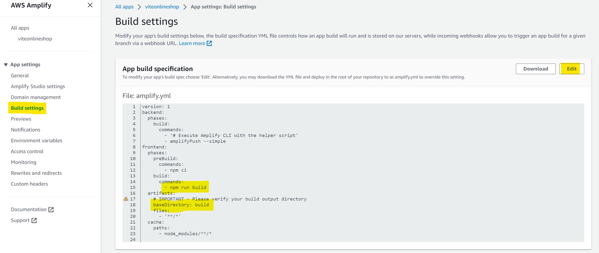

# React-Typescript + Vite + Amplify 05.2023

Please follow my blog at https://dev.to/ethanlloyd21
Checkout my page at https://lloydmarcelino.com

Vite documentation: https://vitejs.dev/guide/

## Setting up React-Typescript + Vite for Amplify:

1. Install Vite
```bash
# npm 6.x
npm create vite@latest my-react-app --template react-ts

# npm 7+, extra double-dash is needed:
npm create vite@latest my-react-app -- --template react-ts

# yarn
yarn create vite my-react-app --template react-ts

# pnpm
pnpm create vite my-react-app --template react-ts
```

2. cd to your project root folder and install the dependencies by running `npm install` (if you are using npm) and start your app by running `npm run dev`
```bash
npm install
npm run dev
```

3. Modify the `index.html` by adding the following script before the closing body tag `</body>`
```html
<script>
    window.global = window;
    window.process = {
      env: { DEBUG: undefined },
    }
    var exports = {};
</script>
```

4. Update the `vite.config.ts` and add a resolve alias inside the `defineConfig({})` as seen below. You need to add the `build output` so Amplify would know where to get the build target of your application.
```javascript
export default defineConfig({
  plugins: [react()],
  resolve: {
      alias: [
      {
        find: './runtimeConfig',
        replacement: './runtimeConfig.browser',
      },
    ]
  },
  //Add build if you are going to use a Git-based (Github or CodeCommit) deployement
  build: {
    outDir: "build",
  }
})
```
* if build is not included inside `defineConfig({})` the application will only work on Amplify manual deployment. In order for the Git-based (CI/CD pipeline) deployment to work, `build output` must be present. 
```bash
 build: {
    outDir: "build",
  }
```

5. Update the `tsconfig.json` file and add `skipLibCheck: true` under `compilerOptions`.
```bash
    "compilerOptions": {
        "skipLibCheck": true,
    }
...
```

# IMPORTANT!!! 

When initializing your backend on Amplify `amplify init` (You can follow the steps here: https://docs.amplify.aws/start/getting-started/setup/q/integration/react/) make sure you select `No` when asked `Initialize the project with the above configuration?`
```bash
? Enter a name for the project reactamplified
The following configuration will be applied:

?Project information
| Name:  reactamplified
| Environment: dev
| Default editor: Visual Studio Code
| App type: javascript
| Javascript framework: react
| Source Directory Path: src
| Distribution Directory Path: build
| Build Command: npm run-script build
| Start Command: npm run-script start

? Initialize the project with the above configuration? No

```
Amplify will ask you to prompt your response manually. Once you get to the `Build Command` question, type

```bash
npm run build
```
and for the `Start Command`, type
```bash
npm run dev
```
This is very important because 
```bash
| Start Command: npm run-script start
```
will not work. Since you are using `Vite`, you need to modify the start and build command for Amplify to mirror your package.json. Check your package.json and you will see that `npm run dev` will start your application not `npm run start`
```bash
"scripts": {
    "dev": "vite",
    "build": "tsc && vite build",
    "lint": "eslint src --ext ts,tsx --report-unused-disable-directives --max-warnings 0",
    "preview": "vite preview"
  },
```
Finally you should have something like this:
```bash
| Name:  reactamplified
| Environment: dev
| Default editor: Visual Studio Code
| App type: javascript
| Javascript framework: react
| Source Directory Path: src
| Distribution Directory Path: build
| Build Command: npm run build
| Start Command: npm run dev
```

For information on how to set up Amplify please visit https://docs.amplify.aws/start/q/integration/react/


# Let me repeat my self

* if `build` is not included inside `defineConfig({})` of your `vite.config.ts` the application will only work on Amplify manual deployment. In order for the Git-based (CI/CD pipeline) deployment to work, `build` output must be present. 
```javascript
export default defineConfig({
  plugins: [react()],
  resolve: {
      alias: [
      {
        find: './runtimeConfig',
        replacement: './runtimeConfig.browser',
      },
    ]
  },
  build: {
    outDir: "build",
  }
})
```
Go to your aws console > Amplify > your app > Build Settings > amplify.yml and check if all settings are correct. Make sure that the `build commands` is `npm run build` and `artifacts baseDirectory` is set to `build`


```diff
- if you don't follow these intructions, you will get a blank page with errors!
```

